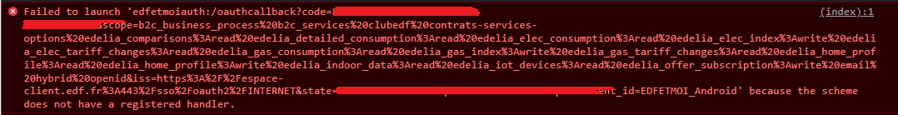

.. _usage:

Usage
=====

.. _installation:

Installation
------------

This package is available on `PyPI <https://pypi.org/project/edf-api/>`_ .
To use EDF-API, first install it using pip:

.. code-block:: console

    pip install edf_api

Usage
-----

You can use the ``cli.py`` file at the root of this repo to test this package in an interactive way.

The API authentication and user data retreival is done with the :meth:`edf_api.auth.EDFAuth` class.
The grid status and consumption data are retrieved with the :meth:`edf_api.EDFApi` class.

To retrieve the consumption data every 30min, you first need to have a connected power meter (Linky) and opt-in the hourly reporting in your EDF account.

The documentations for the available functions is available here: :doc:`edf_api`

Also note that when requesting daily/hourly data, the year and month must be the same for the start and end date.

First authentication
--------------------

For the first authentication, in order to obtain an access_token and a refresh_token, you need to redirect the user to the EDF login portal.
This portal will then redirect to a specific url and provide the code and state parameters.

By default in the function :meth:`edf_api.auth.EDFAuth.get_login_url` this url is ``edfetmoiauth:/oauthcallback`` which will raise an error in the javascript console (because the scheme is unknown).
You can then retrieve this error and parse it (there is an example to do so in the cli.py demo file), this is currently the only way to retrieve the result as the redirect url is restricted (any other one will be refused by the server).

Building
--------

To build this package, you need to install the dependancies:

.. code-block:: console

    pip install build twine

And run ``python -m build`` to generate the packages.
